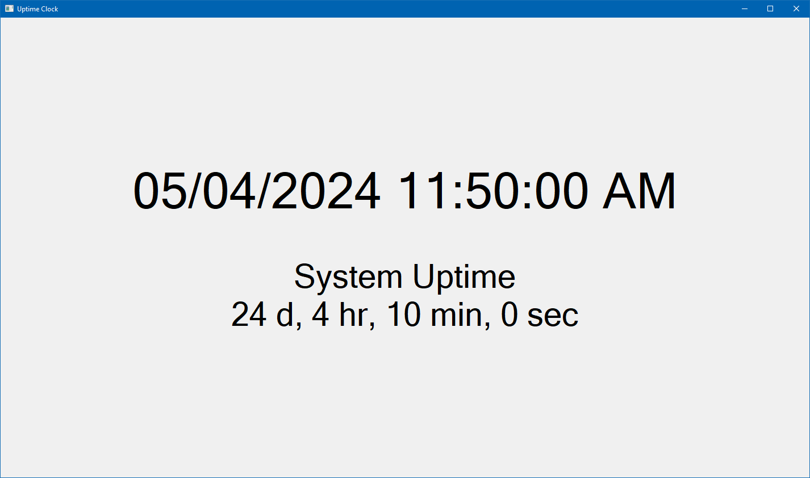

This is a simple Windows utility for diagnosing freezes and other intermittent problems. It displays a clock with the system uptime underneath. If the computer freezes, you can thus mark the instant it happened. Power saving features are disabled while the clock is running.

